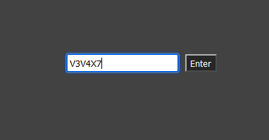
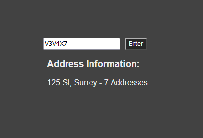

# Canadian Postal Code Locator App

This project is a simple web application built with **Next.js** and **TypeScript** that allows users to look up address information based on a valid Canadian postal code. It uses the Canada Post API to fetch the address details.

## Features

- Input validation for Canadian postal codes.
- Real-time address lookup using the Canada Post API.
- User-friendly interface.

---

## Prerequisites

Before you begin, ensure you have the following installed on your machine:

- **Node.js** (v14 or higher)
- **npm** (v6 or higher)

---

## Installation and Setup

Follow these steps to set up and run the application locally:

1. **Clone the repository**:
    ```bash
   git clone git@github.com:Bryan-Douglas/itprobuy.git
   cd itprobuy


2. **Install dependencies**:
    ```bash
    npm install Next React React-Dom Sass

3. **Set up environment variables**:
    Create a .env.local file in the root directory and add the Canada Post API key:
    ```bash
    CANADA_POST_API_KEY=PROVIDED_KEY

4. **Run the development server**:
    ```bash
    npm run dev

5. **Open the application**:
    The application will be available at http://localhost:3000.

## How to use this application:

1) Type in a valid Canadian postal code.
    Example: V3V 4X7



2) Submit the postal code by either hitting the Enter key or clicking the Enter button next to the input field. The address details will be displayed.



## Troubleshooting

**If you encounter issues**:

   - Ensure that your Canada Post API key is valid and correctly set in .env.local.
   - Check that you are using a valid postal code in the format A1A 1A1.
   - Ensure you have a stable internet connection.
   - Restart the development server after making changes to environment variables.

**Technologies Used**:

   - Next.js – Framework for building server-side rendered React applications.
   - React – JavaScript library for building user interfaces.
   - TypeScript – Typed JavaScript for safer code.
   - Sass – CSS preprocessor for more flexible stylesheets.

## API Documentation

**Endpoint**:
    ```bash
    GET /api/address

**Description**:
    This endpoint fetches address information from the Canada Post API based on a provided Canadian postal code.

**Request**:
    Query Parameters 

    | Parameter | Type | Description | Required |
    |-------------|-------------|-------------|-------------|
    | Zip | string | The Canadian postal code to look up. Must be in the format A1A 1A1. | Yes | 

    Example Request:
    ``` bash
    GET http://localhost:3000/api/address?zip=V3V4X7

**Response**:
    Success Response (200 OK)

    Returns the address details for the given postal code.

    Example JSON Response:  
    ```bash
          {
  "Id": "12345",
  "Text": "123 Main St",
  "Highlight": "123 Main St",
  "Cursor": "",
  "Description": "123 Main St, Vancouver, BC, V3V 4X7, Canada"
}

    | Field | Type | Description |
    |-------------|-------------|-------------|
    | id | string | Unique identifier of the address. |
    | Text | string | The display text for the address. |
    | Highlight | string | Highlighted address text. |
    | Cursor | string | Cursor position for the address lookup. |
    | Description | string | Full address description. |

    Error Responses
    | Status Code | Description |
    |-------------|-------------|
    | 400 | ZIP code is required. |
    | 404 | No address found for the provided postal code. |
    | 500  | Failed to fetch data from Canada Post. |
    
    Example Error Response (400 Bad Request):
    ```bash
    {
  "error": "ZIP code is required."
}

**Usage Notes**:
   - The postal code must be a valid Canadian postal code format (e.g., V3V 4X7 or V3V4X7).
   - Ensure the environment variable CANADA_POST_API_KEY is correctly set up in .env.local for the API to function.